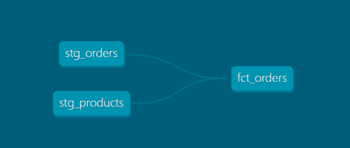

# 🛒 E-commerce Data Warehouse
[](https://www.getdbt.com/)
[](https://github.com/poloman2308/ecommerce-data-warehouse)
[](LICENSE)

A modern data warehouse for e-commerce analytics using **dbt + PostgreSQL*

---

## 📊 Overview

This project builds a **dimensional data warehouse** for a fictional e-commerce company.  
It transforms raw CSV files (orders, customers, products) into clean, analytics-ready models using **dbt**.

### 🔧 Tools Used:
- PostgreSQL (via Docker)
- dbt Core (open-source)
- Git + GitHub
- Data quality testing (`not_null`, `unique`)
- Auto-generated documentation (`dbt docs`)

---

## ⚙️ Data Pipeline Architecture

```nginx
📁 CSV Files
   ↓
🗃️ raw_* tables (PostgreSQL)
   ↓
🧼 stg_* models (cleaned, normalized via dbt)
   ↓
🧠 dim_* / fct_* models (analytics-ready)
```

### 🔹 Layer Descriptions:

| Layer         | Description                                                     |
| ------------- | --------------------------------------------------------------- |
| **CSV Files** | Raw source data (`customers.csv`, `orders.csv`, `products.csv`) |
| **raw\_**\*   | Raw tables loaded into PostgreSQL without transformation        |
| **stg\_**\*   | Staging models that clean and normalize raw data                |
| **dim\_**\*   | Dimension models used for lookups (e.g., `dim_customers`)       |
| **fct\_**\*   | Fact models used for analytics (e.g., `fct_orders`)             |

✅ This layered approach ensures data is trustworthy, testable, and analytics-ready.
It's designed to support modular, scalable, and production-grade pipelines.

---

## 📂 Project Structure

```plaintext
ecommerce-data-warehouse/
├── data/ # Raw CSVs (customers, orders, products)
├── dbt_project/
│ └── ecommerce_dbt/ # dbt models, tests, docs
├── docker-compose.yml # PostgreSQL container config
├── init_db.sql # Creates the analytics schema
└── README.md
```

---

## 🧪 Example Tests

```yaml
- name: stg_customers
  columns:
    - name: customer_id
      tests:
        - unique
        - not_null
```

---

```bash
dbt test
```

---

## 🌐 Documentation

```bash
dbt docs generate
dbt docs serve
```
Then open: http://localhost:8000

---

## 🧭 Lineage Graph Example

Here's a visual representation of the dbt model relationships (from raw to staging to final models):



---

## 🚀 How to Run This Project

```
git clone https://github.com/poloman2308/ecommerce-data-warehouse.git
cd ecommerce-data-warehouse

# Start PostgresSQL container
docker-compose up -d

# Activate Python virtual environment
venv\Scripts\activate

# Run dbt models
cd dbt_project/ecommerce_dbt
dbt run
dbt test
dbt docs serve
```

---

## 📈 Example Query

```
SELECT
  dc.full_name,
  COUNT(fo.order_id) AS order_count
FROM analytics.dim_customers dc
JOIN analytics.fct_orders fo ON dc.customer_id = fo.customer_id
GROUP BY dc.full_name;
```

---

## 👨‍💻 Author

**Derek Acevedo**  
📍 [GitHub](https://github.com/poloman2308)  
📄 [LinkedIn](https://www.linkedin.com/in/derekacevedo86)

