# 🏬 E-commerce Data Warehouse

[](LICENSE)
[](https://www.apache.org/licenses/LICENSE-2.0)
[](https://opensource.org/licenses/PostgreSQL)
[](https://opensource.org/licenses/BSD-3-Clause)
[](https://www.gnu.org/licenses/lgpl-3.0.html)
[](https://github.com/poloman2308/ecommerce-data-warehouse/actions)

A modern data warehouse pipeline for e-commerce analytics — built with **dbt**, **Apache Airflow**, **PostgreSQL**, and **Docker**. This project follows ELT best practices, automates freshness checks, generates documentation, and orchestrates tasks via a production-ready Airflow DAG.

---

## 🧱 Architecture

```mermaid
flowchart LR
  subgraph Source_Data
    A1[raw_orders.csv]
    A2[raw_customers.csv]
    A3[raw_products.csv]
    A4[raw_returns.csv]
  end

  subgraph Bronze_Layer
    B1[init_db.sql → PostgreSQL]
    A1 --> B1
    A2 --> B1
    A3 --> B1
    A4 --> B1
    B1 --> C1[raw schema]
  end

  subgraph Orchestration
    D1[Airflow DAG: dbt_dag.py]
    C1 --> D1
  end

  subgraph dbt_Transformation
    D1 --> E1[dbt build: staging models]
    E1 --> E2[dbt build: marts layer]
    D1 --> F1[dbt source freshness]
    D1 --> F2[dbt docs generate and serve]
  end
```



---

## 🚀 Features

* Airflow DAG: Automates CSV load, dbt model builds, source freshness checks, and doc generation.

* dbt Models: Modular staging and marts layers using best practices.

* Data Quality Tests: Built-in tests for not_null, unique, and freshness.

* Dockerized: Fully containerized dev environment.

* Documentation Site: Self-hosted dbt docs via Airflow task.

---

## 📂 Project Structure

```bash
ecommerce-data-warehouse/
│
├── airflow/
│   └── dags/
│       └── dbt_dag.py              # Airflow DAG definition
│
├── dbt_project/
│   └── ecommerce_dbt/
│       ├── models/
│       │   ├── staging/            # Staging models (stg_*)
│       │   └── marts/              # Fact/dimension models
│       ├── seeds/                  # Optional seed data
│       ├── dbt_project.yml         # DBT project config
│       └── profiles.yml            # DBT profile
│
├── generate_dim_date.py           # Script to generate date dimension
├── init_db.sql                    # Creates raw schema and loads CSVs
├── docker-compose.yml             # Spin up Postgres, Airflow, and dbt
└── README.md
```

---

## 🧪 How to Run Locally

### 1. Clone the repo

```bash
git clone https://github.com/poloman2308/ecommerce-data-warehouse.git
cd ecommerce-data-warehouse
```

### 2. Launch containers

```bash
docker compose up --build
```

### 3. Access Services

* Airflow UI: http://localhost:8080 (login: airflow / airflow)

* DBT Docs: http://localhost:8081

* Postgres: localhost:5432 (user: airflow, db: airflow)

### 4. Trigger DAG

* Navigate to Airflow UI → Turn on dbt_dag_ecommerce

---

## ⚙️ Airflow DAG Overview

| Task ID                | Description                          |
| ---------------------- | ------------------------------------ |
| `init_db`              | Loads CSVs into PostgreSQL (`raw.*`) |
| `dbt_source_freshness` | Runs `dbt source freshness` checks   |
| `dbt_build`            | Runs `dbt build` (models + tests)    |
| `dbt_docs_generate`    | Generates static HTML docs           |
| `dbt_docs_serve`       | Serves docs at port 8081             |

---

## 📊 Example Models

Fact Table: fct_orders
* Joins orders, customers, products, returns, and date_dim

* Enriched with order status, return flags, and derived date fields

Dimension Table: dim_customers
* Extracted from raw_customers

* Includes signup date, email domain, and lifecycle segmentation

---

## 🔐 Environment Variables

Create a .env (optional if customizing):

```env
POSTGRES_USER=airflow
POSTGRES_PASSWORD=airflow
POSTGRES_DB=airflow
```

---

## 🧠 Future Enhancements

* Add real-time ingestion via Kafka

* CI/CD with GitHub Actions for dbt build/test

* Data visualizations with Metabase or Superset

* Add pytest or Great Expectations for validation

---

## 📚 Table of Contents

- [Architecture](#-architecture)
- [Features](#-features)
- [Project Structure](#-project-structure)
- [How to Run Locally](#-how-to-run-locally)
- [Airflow DAG Overview](#️-airflow-dag-overview)
- [Example Models](#-example-models)
- [Environment Variables](#-environment-variables)
- [Future Enhancements](#-future-enhancements)
- [Author](#-author)

---

## 🙋‍♂️ Author

**Derek Acevedo**  
📍 [GitHub](https://github.com/poloman2308)  
📄 [LinkedIn](https://www.linkedin.com/in/derekacevedo86)


