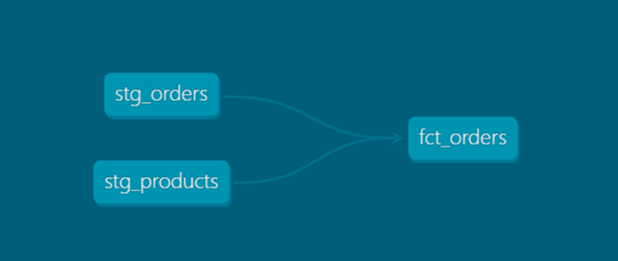

# 🛒 E-commerce Data Warehouse  
> A modern data warehouse for e-commerce analytics using **dbt + PostgreSQL**  

[](https://www.getdbt.com/)
[](https://github.com/poloman2308/ecommerce-data-warehouse)
[](LICENSE)

---

## 📊 Overview

This project builds a **dimensional data warehouse** for a fictional e-commerce company.  
It transforms raw CSV files (orders, customers, products) into clean, analytics-ready models using **dbt**.

### 🔧 Tools Used:
- PostgreSQL (via Docker)
- dbt Core (open-source)
- Git + GitHub
- Data quality testing (`not_null`, `unique`)
- Auto-generated documentation (`dbt docs`)

---

## ⚙️ Architecture

📁 CSV Files
   ↓
🗃️ raw_* tables (PostgreSQL)
   ↓
🧼 stg_* models (cleaned, normalized via dbt)
   ↓
🧠 dim_* / fct_* models (analytics-ready)

---

## 📂 Project Structure

ecommerce-data-warehouse/
├── data/ # Raw CSVs (customers, orders, products)
├── dbt_project/
│ └── ecommerce_dbt/ # dbt models, tests, docs
├── docker-compose.yml # PostgreSQL container config
├── init_db.sql # Creates the analytics schema
└── README.md

---

## 🧭 Lineage Graph Example

Here's a visual representation of the dbt model relationships (from raw to staging to final models):



---

## 🧪 Data Quality Tests

Sample dbt test definition:

```yaml
- name: stg_customers
  description: "Staging customers model"
  columns:
    - name: customer_id
      tests:
        - unique
        - not_null

---

git clone https://github.com/poloman2308/ecommerce-data-warehouse.git
cd ecommerce-data-warehouse

# Start PostgresSQL container
docker-compose up -d

# Activate Python virtual environment
venv\Scripts\activate

# Run dbt models
cd dbt_project/ecommerce_dbt
dbt run
dbt test
dbt docs serve

---

SELECT
  dc.full_name,
  COUNT(fo.order_id) AS order_count
FROM analytics.dim_customers dc
JOIN analytics.fct_orders fo ON dc.customer_id = fo.customer_id
GROUP BY dc.full_name;

---

## 👨‍💻 Author

**Derek Acevedo**  
📍 [![GitHub]](https://github.com/poloman2308)  
📄 [![LinkedIn]](https://www.linkedin.com/in/derekacevedo86)

